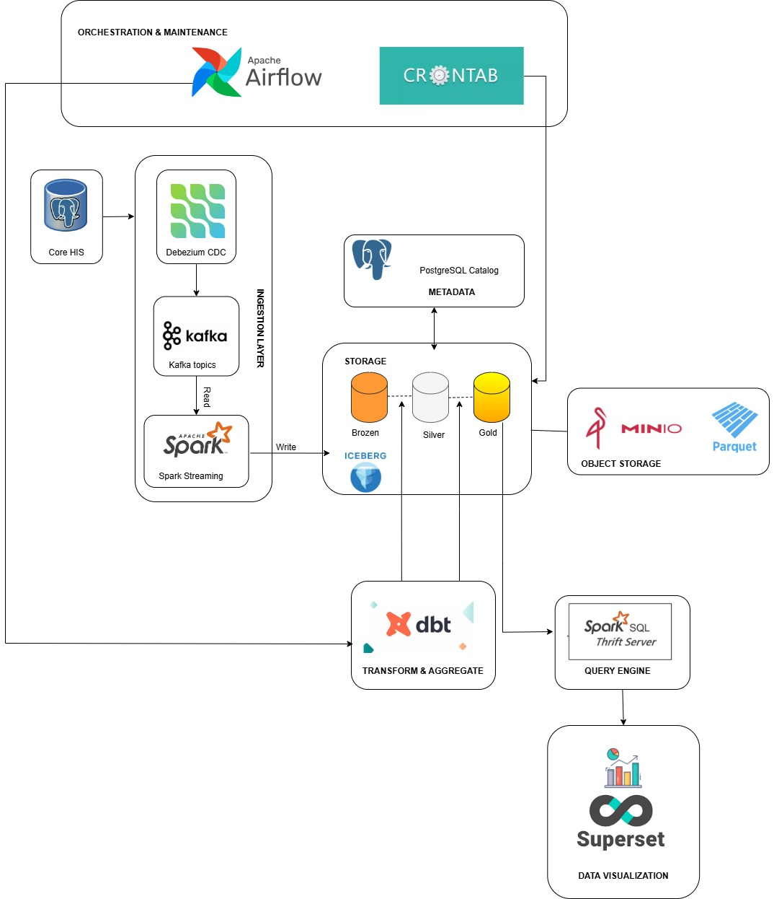
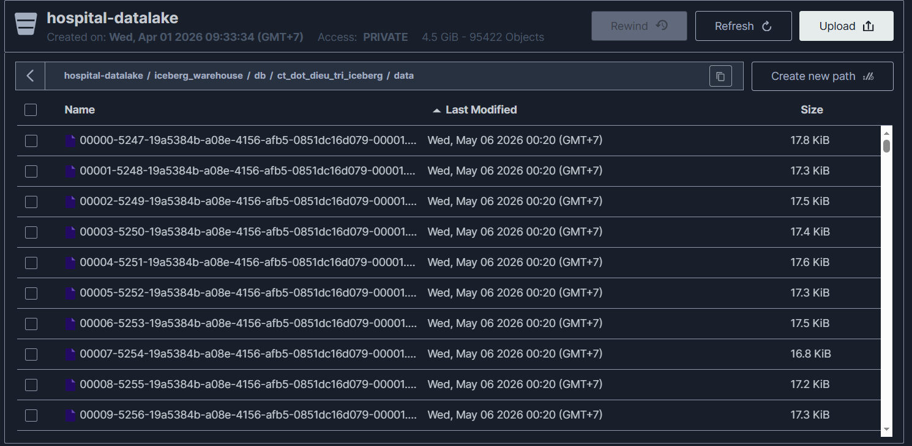
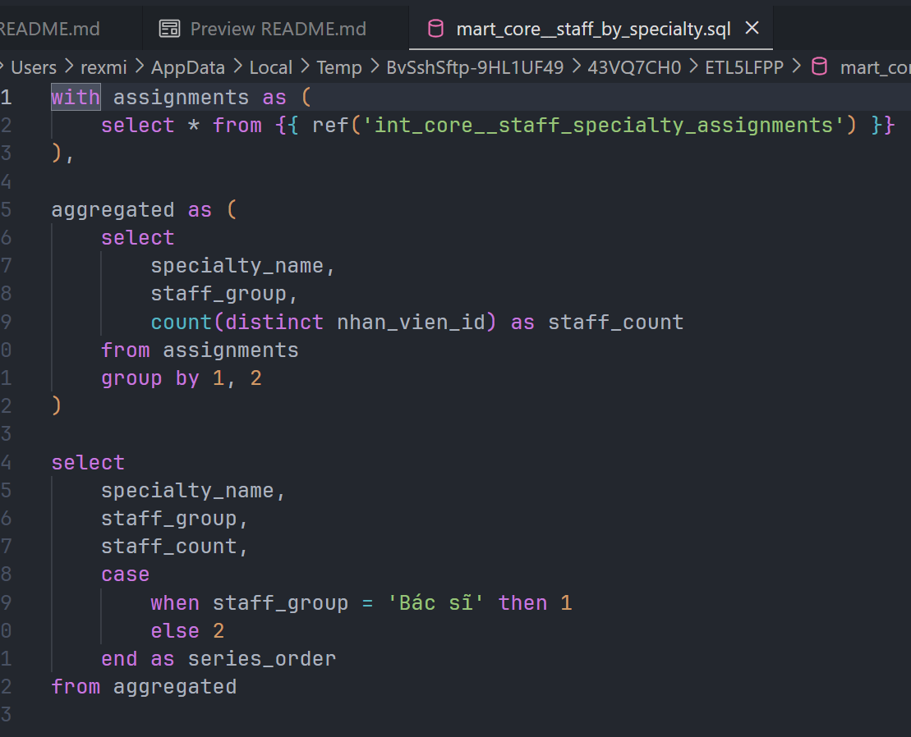
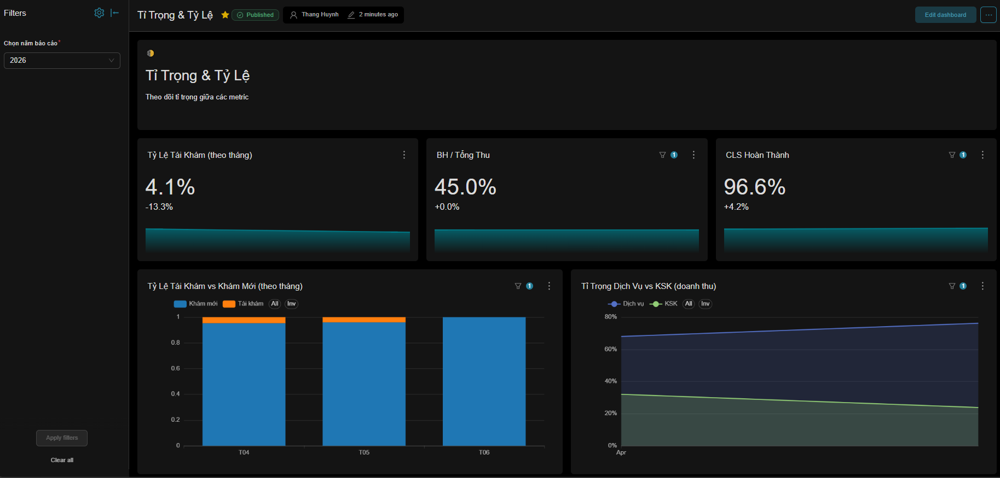
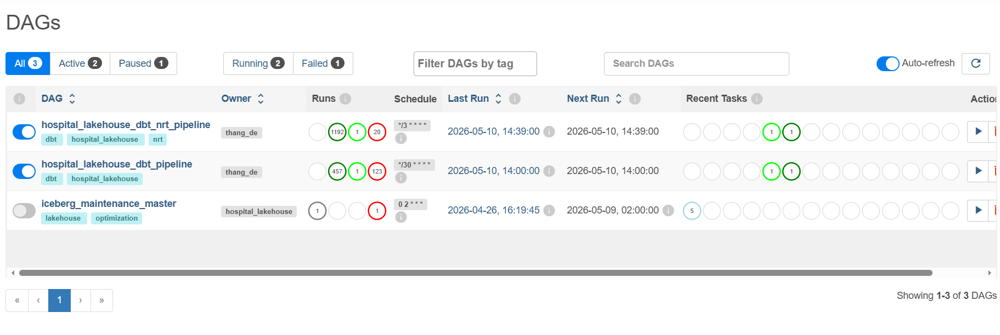
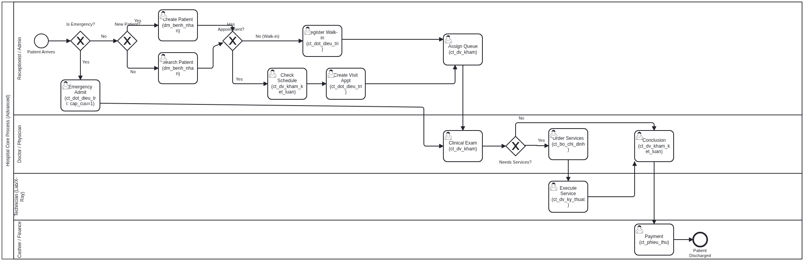

# Data Lakehouse Platform Cho Bệnh Viện

<!-- *English version: [README.md](./README.md).*

Nền tảng này xây dựng một pipeline dữ liệu bệnh viện theo kiến trúc lakehouse, đưa dữ liệu giao dịch từ hệ thống HIS vào môi trường phân tích gần thời gian thực. Thiết kế tập trung vào 4 yếu tố cốt lõi: **chính xác**, **nhanh chóng**, **ổn định** và **bảo mật**. -->

Pipeline chính:

`Core HIS -> Debezium -> Kafka -> Spark Structured Streaming -> Apache Iceberg on MinIO -> dbt -> Spark Thrift Server -> Apache Superset`

## Mục Lục

- [1. Mục Tiêu](#1-mục-tiêu)
- [2. Bốn Giá Trị Kỹ Thuật](#2-bốn-giá-trị-kỹ-thuật)
  - [2.1 Chính Xác](#21-chính-xác)
  - [2.2 Nhanh Chóng](#22-nhanh-chóng)
  - [2.3 Ổn Định](#23-ổn-định)
  - [2.4 Bảo Mật](#24-bảo-mật)
- [3. Kiến Trúc Tổng Quan](#3-kiến-trúc-tổng-quan)
- [4. Luồng Dữ Liệu Đầu Cuối](#4-luồng-dữ-liệu-đầu-cuối)
- [5. Thiết Kế Theo Từng Lớp](#5-thiết-kế-theo-từng-lớp)
  - [5.1 Input, Processing Và Output](#51-input-processing-và-output)
  - [5.2 Bronze, Silver Và Gold](#52-bronze-silver-và-gold)
  - [5.3 Vì Sao Dùng Apache Iceberg](#53-vì-sao-dùng-apache-iceberg)
  - [5.4 Vai Trò Của PostgreSQL Catalog](#54-vai-trò-của-postgresql-catalog)
  - [5.5 dbt Transformation](#55-dbt-transformation)
- [6. Dashboard Và Phân Tích](#6-dashboard-và-phân-tích)
- [7. Vận Hành Và Bảo Trì](#7-vận-hành-và-bảo-trì)
  - [7.1 Airflow](#71-airflow)
  - [7.2 Maintenance Iceberg Và MinIO](#72-maintenance-iceberg-và-minio)
  - [7.3 Triển Khai Trên VPS](#73-triển-khai-trên-vps)
- [8. Tài Liệu Nghiệp Vụ](#8-tài-liệu-nghiệp-vụ)
- [9. Kỹ Năng Đạt Được](#9-kỹ-năng-đạt-được)
  - [9.1 Kỹ Năng Kỹ Thuật](#91-kỹ-năng-kỹ-thuật)
  - [9.2 Kỹ Năng Công Cụ](#92-kỹ-năng-công-cụ)
  - [9.3 Kiến Thức Domain](#93-kiến-thức-domain)
- [10. Định Hướng Phát Triển](#10-định-hướng-phát-triển)
- [Tổng Kết](#tổng-kết)

## 1. Mục Tiêu

Dữ liệu bệnh viện phát sinh liên tục từ đăng ký bệnh nhân, khám bệnh, chỉ định dịch vụ, cận lâm sàng, thanh toán, cấp phát thuốc và các hoạt động vận hành khác. Các hệ thống HIS thường tối ưu cho giao dịch hằng ngày, không phải cho báo cáo liên phòng ban, phân tích lịch sử hoặc dashboard gần thời gian thực.

Dự án này tạo ra một nền tảng phân tích tập trung để:

- Theo dõi hoạt động bệnh viện gần thời gian thực.
- Chuẩn hóa dữ liệu nguồn thành các bảng phân tích đáng tin cậy.
- Phục vụ dashboard cho ban giám đốc, khoa phòng, kế toán, nhân sự và dược.
- Lưu lịch sử thay đổi dữ liệu theo snapshot để hỗ trợ kiểm tra, đối soát và mở rộng phân tích.
- Tạo nền tảng cho machine learning, AI hoặc chatbot nghiệp vụ trong tương lai.

## 2. Bốn Giá Trị Kỹ Thuật

### 2.1 Chính Xác

Hệ thống ưu tiên tính đúng của dữ liệu từ lúc phát sinh ở HIS đến lúc xuất hiện trên dashboard.

- `Debezium` ghi nhận thay đổi bằng CDC, bao gồm insert, update và delete, thay vì phụ thuộc vào batch export thủ công.
- `Spark Structured Streaming` giữ lại các trường kỹ thuật như `op` và `ts_ms` để downstream biết bản ghi là tạo mới, cập nhật hay xóa.
- `MERGE INTO` trên `Apache Iceberg` giúp cập nhật đúng trạng thái mới nhất của từng bản ghi theo khóa chính.
- Logic deduplicate trong micro-batch dùng bản ghi mới nhất theo `ts_ms`, hạn chế sai lệch khi cùng một khóa có nhiều thay đổi trong thời gian ngắn.
- `dbt` tách rõ các lớp staging, intermediate và mart để biến đổi dữ liệu có kiểm soát, dễ đọc, dễ kiểm tra và dễ mở rộng.
- Iceberg snapshot cho phép truy vấn lại phiên bản cũ khi cần đối soát hoặc phục hồi sau lỗi biến đổi.

### 2.2 Nhanh Chóng

Hệ thống được thiết kế để đưa dữ liệu mới từ HIS lên lớp phân tích với độ trễ thấp nhưng vẫn kiểm soát được tài nguyên.

- CDC đẩy thay đổi vào `Kafka` liên tục, không cần chờ export toàn bảng.
- Spark Streaming đọc Kafka 24/7 và ghi vào Bronze theo micro-batch.
- Trigger ingest được thiết kế quanh chu kỳ ngắn, ví dụ 1 phút cho lớp raw.
- Dashboard near real-time dùng bảng Gold vật lý được dbt cập nhật incremental.
- Airflow có DAG riêng cho luồng NRT, chạy theo chu kỳ 3 phút với `schedule_interval='*/3 * * * *'`.
- Superset đọc trực tiếp từ bảng Gold đã làm sạch qua Spark Thrift Server, có thể cấu hình auto refresh 1-5 phút cho dashboard vận hành.

### 2.3 Ổn Định

Pipeline được tách lớp rõ ràng để mỗi thành phần làm đúng vai trò, tránh chồng chéo và giảm rủi ro khi vận hành trên VPS tài nguyên vừa phải.

- Spark Streaming chỉ chịu trách nhiệm ingest liên tục từ Kafka vào Iceberg, không bị Airflow khởi động lại theo lịch.
- Airflow chỉ điều phối dbt và tác vụ bảo trì, giúp workflow dễ quan sát và dễ retry.
- `max_active_runs=1` ngăn các lần chạy dbt chồng lên nhau.
- `catchup=False` tránh chạy bù hàng loạt sau downtime, giảm nguy cơ tràn RAM hoặc nghẽn server.
- Iceberg hỗ trợ ACID transaction, giúp dashboard không đọc phải trạng thái nửa ghi nửa chưa ghi.
- Các tác vụ `rewrite_data_files`, `rewrite_manifests` và `expire_snapshots` kiểm soát small files, metadata và dung lượng lưu trữ.
- Các service dài hạn như Spark job, Spark Thrift Server, Airflow và Superset có thể chạy bằng `systemd`, `tmux` hoặc `nohup` tùy môi trường.

### 2.4 Bảo Mật

Thiết kế bảo mật tập trung vào tách trách nhiệm dữ liệu, kiểm soát truy cập và giảm phạm vi phơi bày dữ liệu y tế.

- Dữ liệu nghiệp vụ nằm trong MinIO dưới dạng Parquet/Iceberg; PostgreSQL catalog chỉ lưu metadata, không lưu dữ liệu y tế gốc.
- Dashboard Superset được phân quyền theo vai trò, ví dụ ban giám đốc, trưởng khoa, kế toán, nhân sự và dược.
- Người dùng cuối truy cập qua dashboard hoặc SQL serving layer, không truy cập trực tiếp vào hệ thống HIS vận hành.
- Các khóa truy cập MinIO, PostgreSQL và service account được tách khỏi logic model, giúp dễ quản lý bằng biến môi trường hoặc file cấu hình riêng.
- Kiến trúc lakehouse tách workload phân tích khỏi database nguồn, giảm rủi ro dashboard hoặc truy vấn nặng ảnh hưởng hệ thống vận hành bệnh viện.
- Iceberg snapshot và metadata catalog giúp kiểm soát lịch sử thay đổi, hỗ trợ truy vết khi cần kiểm tra dữ liệu.

## 3. Kiến Trúc Tổng Quan

  
   
  <b>Figure 1:</b> Flow chart

Hệ thống gồm các thành phần chính:

- `Core HIS`: hệ thống nguồn phát sinh dữ liệu bệnh viện.
- `Debezium`: bắt CDC từ database nguồn.
- `Kafka`: vận chuyển sự kiện thay đổi dữ liệu.
- `Spark Structured Streaming`: đọc Kafka và ghi dữ liệu raw vào Iceberg.
- `MinIO`: object storage chứa file Parquet vật lý.
- `Apache Iceberg`: table format hỗ trợ ACID, snapshot, merge, delete và schema evolution.
- `PostgreSQL JDBC Catalog`: lưu metadata Iceberg như bảng, manifest, snapshot và vị trí file.
- `dbt`: biến đổi dữ liệu từ raw thành staging, intermediate và mart.
- `Airflow` và `Crontab`: điều phối job transform và bảo trì.
- `Spark Thrift Server`: cung cấp cổng SQL cho BI tool.
- `Superset`: dashboard, chart và phân quyền người dùng.

## 4. Luồng Dữ Liệu Đầu Cuối

1. Dữ liệu phát sinh trong Core HIS khi có đăng ký, lượt khám, dịch vụ, thanh toán hoặc thao tác vận hành.
2. Debezium đọc thay đổi từ database nguồn và publish sự kiện CDC vào Kafka topic.
3. Spark Structured Streaming consume Kafka, parse CDC envelope và chuẩn hóa các cột kỹ thuật.
4. Spark ghi dữ liệu vào bảng Iceberg trên MinIO bằng cơ chế upsert/delete theo khóa chính.
5. PostgreSQL catalog ghi nhận metadata của bảng Iceberg, snapshot và file liên quan.
6. dbt đọc dữ liệu raw qua Spark, xây dựng staging, intermediate và mart.
7. Airflow điều phối dbt theo lịch batch hoặc near real-time.
8. Spark Thrift Server mở lớp SQL để Superset truy vấn dữ liệu đã chuẩn hóa.
9. Superset hiển thị dashboard theo vai trò người dùng.

## 5. Thiết Kế Theo Từng Lớp

### 5.1 Input, Processing Và Output

- `Input`: dữ liệu giao dịch từ HIS, bao gồm bệnh nhân, lượt khám, dịch vụ, thanh toán, khoa phòng, nhân viên, thuốc và các hoạt động nghiệp vụ liên quan.
- `Processing`: Debezium CDC, Kafka streaming, Spark Structured Streaming, Iceberg table format, dbt transformation, Airflow orchestration.
- `Output`: bảng Bronze, Silver, Gold; mart nghiệp vụ; dashboard Superset; lớp truy vấn SQL qua Spark Thrift Server.

Tài liệu mô tả dữ liệu: [Google Sheet](https://docs.google.com/spreadsheets/d/1eGdW56kQfhWlkBmLUB7z0Jgh5vEu-bKBL0QVoc3e2bI/edit?usp=sharing).

### 5.2 Bronze, Silver Và Gold

- `Bronze`: lưu dữ liệu CDC raw từ Kafka, giữ các thông tin kỹ thuật như `op`, `ts_ms` và thời điểm ingest.
- `Silver`: làm sạch, chuẩn hóa kiểu dữ liệu, chuẩn hóa khóa và loại bỏ nhiễu cơ bản.
- `Gold`: bảng phân tích sẵn sàng cho dashboard, KPI và báo cáo nghiệp vụ.

  
   
  <b>Figure 2:</b> Parquet files in Iceberg format

### 5.3 Vì Sao Dùng Apache Iceberg

Iceberg là thành phần trung tâm vì pipeline CDC cần nhiều hơn việc ghi file CSV, JSON hoặc Parquet rời rạc.

- `ACID transactions`: đọc ghi an toàn, tránh dashboard đọc trạng thái chưa commit.
- `MERGE INTO`: hỗ trợ upsert và delete từ sự kiện CDC.
- `Time travel`: xem lại dữ liệu theo snapshot hoặc thời điểm.
- `Schema evolution`: thay đổi schema có kiểm soát khi hệ thống nguồn phát triển.
- `Metadata pruning`: Spark có thể bỏ qua file không liên quan, tăng tốc truy vấn.
- `Compaction`: gom small files để cải thiện hiệu năng dashboard và giảm overhead metadata.

### 5.4 Vai Trò Của PostgreSQL Catalog

PostgreSQL trong dự án không đóng vai trò kho dữ liệu nghiệp vụ. Nó là catalog metadata cho Iceberg.

PostgreSQL lưu:

- Tên bảng và schema.
- Vị trí bảng trong MinIO.
- Snapshot hiện tại và snapshot cũ.
- Manifest và metadata phục vụ lập kế hoạch truy vấn.

Cách tách này giúp dữ liệu y tế vật lý nằm trong MinIO, còn metadata phục vụ quản lý bảng nằm trong PostgreSQL. Spark, dbt và Superset thông qua Spark Thrift Server dùng catalog để tìm đúng file cần đọc thay vì quét toàn bộ object storage.

### 5.5 dbt Transformation

dbt biến dữ liệu raw thành các model có ý nghĩa nghiệp vụ.

- `staging`: chuẩn hóa bảng nguồn và đặt lại tên cột dễ hiểu hơn.
- `intermediate`: xử lý logic nghiệp vụ dùng lại nhiều lần.
- `marts`: tạo bảng phục vụ dashboard theo domain như clinical, finance, pharmacy, executive, operations và core.
- `incremental model`: chỉ xử lý phần dữ liệu mới hoặc thay đổi, phù hợp dashboard NRT.
- `merge strategy`: cập nhật bảng Gold vật lý thay vì phụ thuộc vào view nặng và chậm.

  
   
  <b>Figure 3:</b> dbt model example

## 6. Dashboard Và Phân Tích

Superset là lớp hiển thị cuối cho người dùng nghiệp vụ. Dashboard được thiết kế theo nhiều nhóm nhu cầu:

- `Near real-time dashboard`: theo dõi hoạt động thay đổi nhanh như lượt khám, bệnh nhân đang chờ, doanh thu trong ngày hoặc mật độ chuyên khoa theo giờ.
- `Management dashboard`: báo cáo tuần, tháng, quý, năm cho quản lý.
- `Department dashboard`: phân tích theo khoa, phòng, nhóm dịch vụ hoặc nhân sự.
- `Executive dashboard`: KPI tổng quan cho ban điều hành.
- `Pharmacy dashboard`: theo dõi đơn thuốc, cấp phát và hoạt động dược.
- `Finance dashboard`: doanh thu, thanh toán, cơ cấu dịch vụ và so sánh theo thời gian.

  
   
  <b>Figure 4:</b> Superset dashboard example

Luồng dashboard NRT:

1. Spark Streaming ghi CDC liên tục vào Bronze.
2. dbt incremental cập nhật Gold theo chu kỳ ngắn.
3. Airflow chạy DAG NRT mỗi 3 phút.
4. Superset đọc bảng Gold đã chuẩn hóa và auto refresh theo nhu cầu.

## 7. Vận Hành Và Bảo Trì

### 7.1 Airflow

Airflow chịu trách nhiệm điều phối các job có điểm bắt đầu và kết thúc rõ ràng, đặc biệt là dbt và maintenance.

  
   
  <b>Figure 5:</b> Airflow DAG

Cấu hình vận hành quan trọng:

- `schedule_interval='*/3 * * * *'` cho workflow near real-time.
- `max_active_runs=1` để tránh job chồng nhau.
- `catchup=False` để không replay hàng loạt sau downtime.
- Tách DAG NRT khỏi DAG batch để giảm rủi ro ảnh hưởng lẫn nhau.

### 7.2 Maintenance Iceberg Và MinIO

Streaming ghi liên tục có thể tạo nhiều small files và metadata. Vì vậy hệ thống cần bảo trì định kỳ:

- `rewrite_data_files`: compact small files thành file lớn hơn.
- `rewrite_manifests`: giảm overhead metadata khi query planning.
- `expire_snapshots`: xóa snapshot quá cũ để kiểm soát dung lượng.
- Theo dõi inode, dung lượng ổ đĩa và kích thước metadata.
- Điều chỉnh timeout, cache và refresh interval trong Superset để tránh gây tải không cần thiết.

### 7.3 Triển Khai Trên VPS

Dự án được thiết kế để chạy trên hạ tầng Linux VPS tài nguyên vừa phải.

- MinIO có thể cài native để giảm overhead so với Docker.
- Spark Streaming chạy dài hạn bằng `tmux`, `nohup` hoặc `systemd`.
- Spark Thrift Server chạy như service riêng để phục vụ SQL.
- Airflow có thể dùng `systemd` để tự restart scheduler và webserver.
- Superset nên dùng metadata database riêng như PostgreSQL thay vì SQLite khi cần vận hành ổn định.

## 8. Tài Liệu Nghiệp Vụ

Dự án không chỉ có pipeline kỹ thuật mà còn có tài liệu hóa nghiệp vụ:

- File `.bpmn` mô tả quy trình như tiếp đón, khám bệnh, chỉ định cận lâm sàng, thanh toán, cấp phát thuốc và khám sức khỏe đoàn.
- File `.dbml` mô tả cấu trúc cơ sở dữ liệu và quan hệ giữa các thực thể.
- Các model dbt phản ánh domain bệnh viện như clinical, finance, pharmacy, operations, executive và core.

  
   
  <b>Figure 6:</b> Business process diagram example

Phần tài liệu này giúp liên kết dữ liệu kỹ thuật với quy trình thực tế, tránh xây dashboard chỉ dựa trên bảng mà không hiểu nghiệp vụ phía sau.

## 9. Kỹ Năng Đạt Được

### 9.1 Kỹ Năng Kỹ Thuật

- Thiết kế kiến trúc lakehouse end-to-end cho dữ liệu bệnh viện.
- Xây dựng pipeline CDC với Debezium, Kafka và Spark Structured Streaming.
- Ghi dữ liệu CDC vào Apache Iceberg bằng upsert/delete.
- Tổ chức dữ liệu theo Bronze, Silver và Gold.
- Xây dựng model dbt cho staging, intermediate và mart.
- Phục vụ dữ liệu phân tích qua Spark Thrift Server và Superset.
- Tối ưu vận hành small files, metadata và snapshot retention.

### 9.2 Kỹ Năng Công Cụ

- Debezium connector và Kafka topic.
- Spark Structured Streaming và Spark SQL.
- MinIO object storage.
- Apache Iceberg và PostgreSQL JDBC Catalog.
- dbt model, incremental và merge.
- Airflow DAG, schedule và retry control.
- Superset dashboard, dataset, chart và role-based access.
- Linux service operation bằng `systemd`, `tmux`, `nohup`, cron và swap.

### 9.3 Kiến Thức Domain

- Hiểu cách dữ liệu bệnh viện phát sinh từ quy trình vận hành.
- Nhận diện các thực thể chính như bệnh nhân, lượt khám, dịch vụ, khoa phòng, nhân viên, hóa đơn và đơn thuốc.
- Phân biệt dữ liệu giao dịch vận hành với dữ liệu phân tích đã chuẩn hóa.
- Thiết kế dashboard theo vai trò người dùng thay vì một dashboard chung cho tất cả.
- Cân bằng giữa nhu cầu cập nhật nhanh và yêu cầu ổn định của hệ thống y tế.

## 10. Định Hướng Phát Triển

- Bổ sung kiểm thử dữ liệu trong dbt để kiểm tra khóa chính, null, quan hệ và giá trị bất thường.
- Chuẩn hóa thêm phân quyền dashboard theo nhóm người dùng thực tế.
- Mở rộng monitoring cho Kafka lag, Spark Streaming status, Airflow run status và Superset query latency.
- Tối ưu retention policy cho Iceberg snapshot theo yêu cầu kiểm toán.
- Phát triển dashboard machine learning hoặc AI assistant trên dữ liệu Gold đã chuẩn hóa.

## Tổng Kết

Dự án này là một nền tảng data lakehouse thực tế cho bệnh viện, kết hợp CDC, streaming, Iceberg table format, dbt transformation, Airflow orchestration và Superset dashboard.

Giá trị chính của thiết kế nằm ở 4 điểm:

- **Chính xác**: CDC, merge theo khóa chính, deduplicate, dbt modeling và Iceberg snapshot.
- **Nhanh chóng**: streaming ingest, incremental transform và dashboard near real-time 3 phút.
- **Ổn định**: tách lớp rõ ràng, Airflow guardrails, ACID transaction và maintenance định kỳ.
- **Bảo mật**: tách hệ thống phân tích khỏi HIS, phân quyền Superset, quản lý metadata riêng và giảm truy cập trực tiếp vào dữ liệu nguồn.
